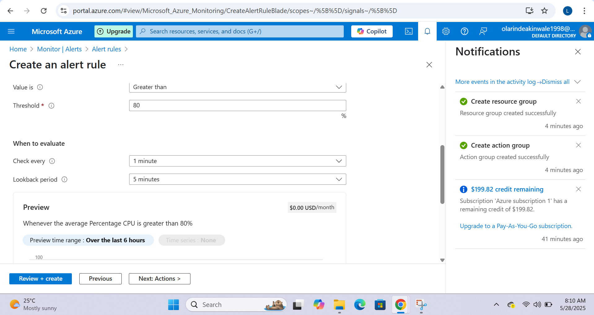
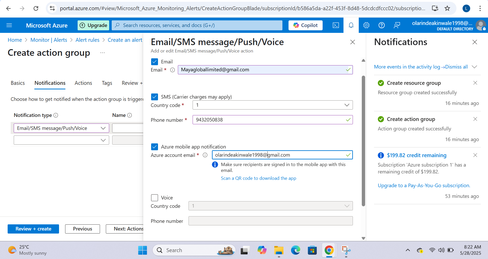
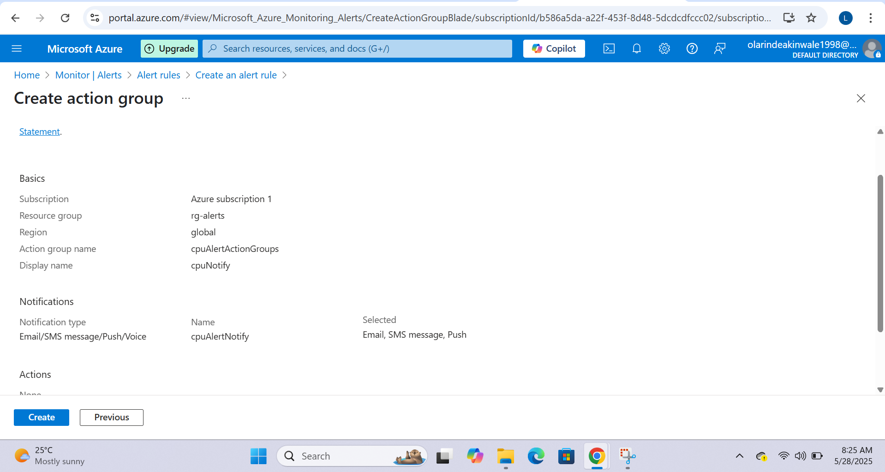
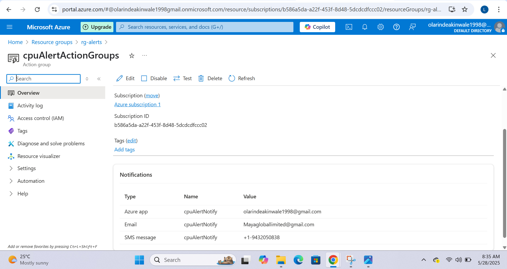
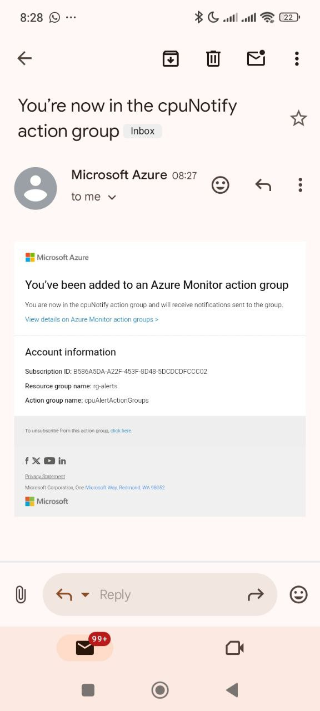

# 🚨 Azure VM CPU Monitoring Alert Project

This project demonstrates how to configure Azure Monitor to trigger alerts when a virtual machine's CPU usage exceeds a certain threshold. This is a crucial real-world task for any Cloud Security Engineer, ensuring that compute resources are operating within safe limits.

## 🔧 What This Covers

- Selecting a VM as a monitoring scope
- Setting a static alert threshold for CPU usage
- Creating an Action Group to send notifications (SMS, Email, App)
- Receiving and validating alert triggers
- Monitoring overview through Azure dashboard

## 🔍 Real-Life Scenario

Imagine you're managing critical workloads on Azure VMs. One of the VMs begins consuming unusually high CPU—possibly due to a misconfigured application or a brute-force attack. With alert rules in place, you'll be notified instantly via SMS/email, enabling rapid response before users are affected or costs escalate.

---

## ✅ Steps Performed

1. Azure Monitor View  
   Visual confirmation from Azure Monitor overview dashboard.  
   
   
3. Set Alert Logic  
   Configured CPU usage alert to trigger if usage is greater than 80% for a continuous 5-minute window.  
   

4. Notification Setup  
   Created an Action Group with Email + SMS alerts to notify on trigger.  
   

5. Summary Review  
   Reviewed the entire alert rule configuration before deployment.  
   

6. Alert Rule Created  
   Successfully created and deployed the alert rule.  
   

7. Notification Received  
   Received a real-time SMS and email alert when CPU usage met the threshold.  
     
   

8. Azure Monitor View  
   Visual confirmation from Azure Monitor overview dashboard.  
   
---

## 🔐 Key Takeaways

- Alerts provide proactive security and performance awareness.
- Action groups let you decide *how* and *who* to notify when alerts fire.
- Using Azure Monitor is essential for real-time observability in cloud operations.

---

## 👨‍💻 Author

Olarinde Akinwale  
Cloud Security Engineer in Training | Azure Enthusiast

---

## 📌 Repo Highlights

This repo is part of my AZ-104: Microsoft Azure Administrator hands-on project series. Feel free to explore and reuse the workflow in your own environment!
